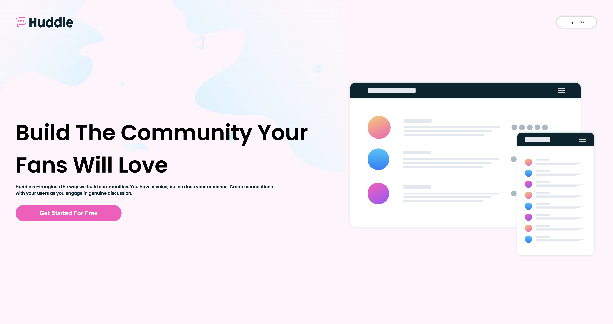
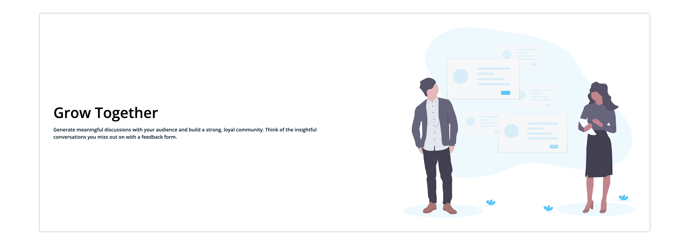
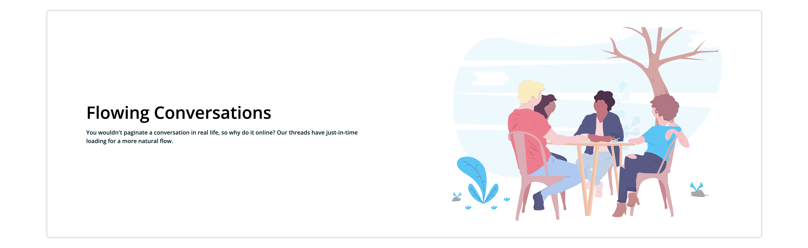
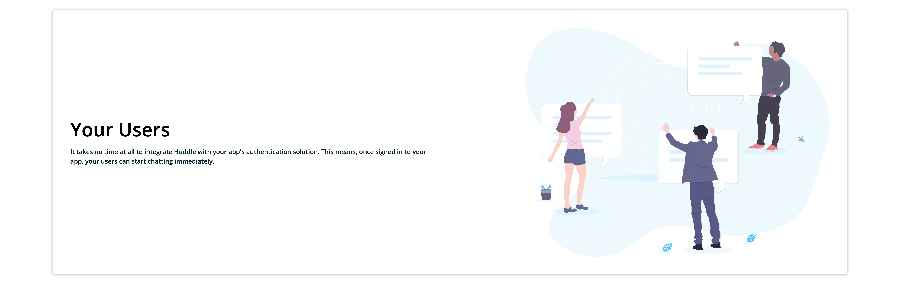
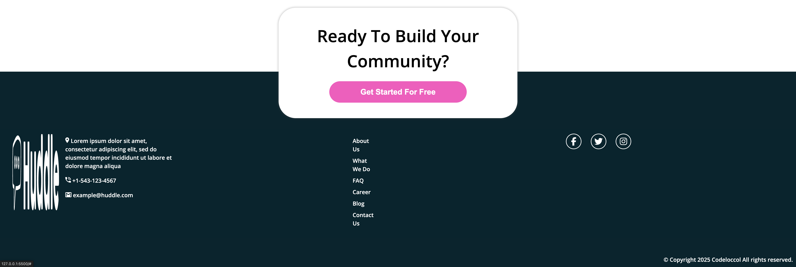

# 🌐 Landing Page – Projet Web

## 📝 Description

Ce projet consiste en la conception d’une landing page moderne et responsive, réalisée à l’aide de HTML et CSS.
L’objectif est de présenter un produit, un service ou une marque de manière claire et attrayante, tout en mettant en avant une expérience utilisateur fluide et un design professionnel.

## 🚀 Fonctionnalités

Interface responsive adaptée aux différents écrans (mobile, tablette, desktop)

Design épuré et moderne

Navigation fluide grâce à une structure HTML sémantique

Utilisation de sections bien définies : Header, Hero, Features, Call to Action, Footer

Code clair et facilement modifiable

## 🛠️ Technologies utilisées

HTML5 et CSS3

## 📸 Aperçu

## Demo
